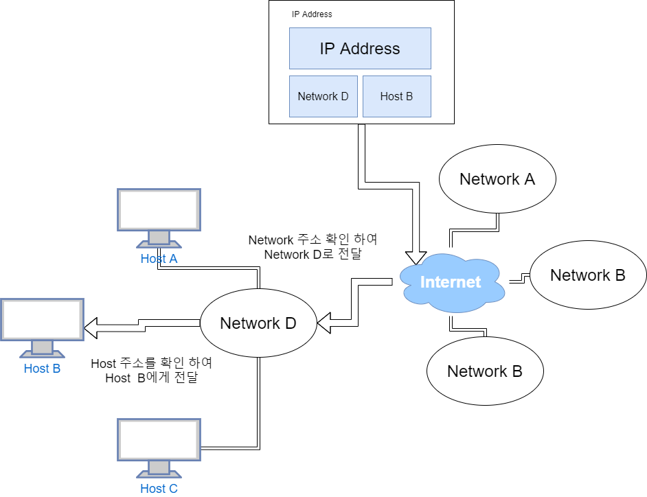

# Netwhat

> "This project is an introduction to network problematics"
>
> #### 📝 PDF
>
> - [**`FILE LINK`**](../pdf/en.subject-Netwhat.pdf)

## 🚀 Content

### 🚩 Mandatory part

#### What is an IP address

IP 주소는 인터넷에 연결된 기기를 식별하는 유일한 식별자 이며 현재 [`IPv4`](#IPv4)와 [`IPv6`](#IPv6)를 사용하고 있다.

##### IPv4

현재 일반적으로 사용되는 IP 주소 이다.

이 주소의 범위는 **32bit**로 **8bit**씩 표기를 하여 8자리로 나타내며 **0.0.0.0 ~ 255.255.255.255** 이다.

이론적으로 42억9496만7296개의 IP가 존재한다.

단 중간의 일부 IP 주소는 특별한 용도를 위해 예약 되어 있으며 예를 들어 127.0.0.1은 자기 자신을 가르키는 주소(localhost)이다.

##### IPv6

시간이 지남에 따라 IP부족 현상을 해결하기 위해 만든 새로운 버전이다.

기존 32bit의 주소에서 **128bit**로 확장된 것이 특징이다.

주소의 표현은 **16bit**씩 표기를 하여 8자리로 나타낸다.

> ex) 2001:0db8:85a3:08d3:1319:8a2e:0370:7334

그러나 대부분의 자리가 0의 숫자를 갖게 되므로, 0000을 하나의 0으로 축약하거나, 혹은 아예 연속되는 0의 그룹을 없애고 ':' 만을 남길 수 있다. 따라서 아래의 IPv6 주소들은 모두 같은 주소를 나타낸다.

```
2001:0DB8:0000:0000:0000:0000:1428:57ab
2001:0DB8:0000:0000:0000::1428:57ab
2001:0DB8:0:0:0:0:1428:57ab
2001:0DB8:0::0:1428:57ab
2001:0DB8::1428:57ab
```

이론적으로 2128개인 약 3.4x1038개(340,282,366,920,938,463,463,374,607,431,768,211,456개)의 주소가 존재하여 거의 무한하게 사용이 가능하다.

##### Network Addres, Host Address


기본적으로 IP Address는 Network Address와 Host Address로 구분이 되어 있다.



 이때 인터넷에서 IP Address로 전달을 요청을 하게 되면 위와 같이 먼저 Network Address를 확인하여 해당하는 네트워크에 전달을 한다. 그 후 전달 받은 Network에서 Host Address를 확인하여 전달을 하게 되는 구조로 이루어져 있다.

#### What is a class of IP addresses

IP version 4 address는 기본적으로 5가지의 클래스로 구분이 된다.

A, B, C, D, E의 클래스로 구성이 되어 있는데 D, E클래스는 특수한 목적으로 사용이 된다.

##### A class

A class는 

#### What is a Netmask


#### What is the subnet of an IP with Netmask

#### What is the broadcast address of a subnet

#### What are the different ways to represent an ip address with the Netmask

#### What are the differences between public and private IPs

#### What is TCP

#### What is UDP

#### What are the network layers

#### What is the OSI model

#### What is a DHCP server and the DHCP protocol

#### What is a DNS server and the DNS protocol

#### What are the rules to make 2 devices communicate using IP addresses

#### How does routing work with IP

#### What is a default gateway for routing

#### What is a port from an IP point of view and what is it used for when connecting to another device