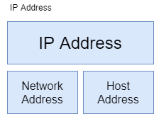
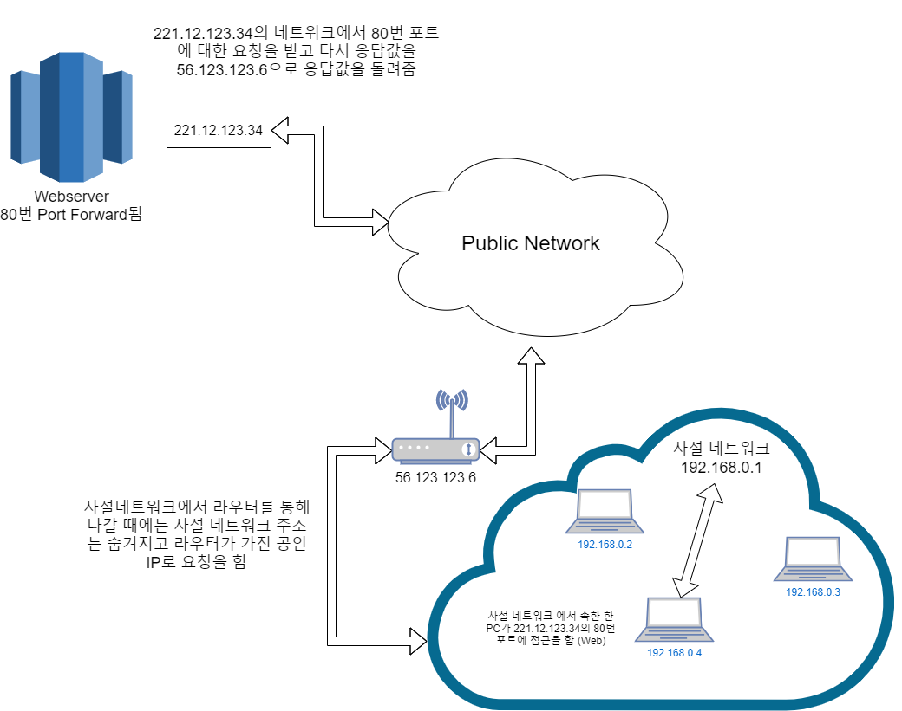

# Netwhat - [](https://github.com/JaeSeoKim/badge42)

> "This project is an introduction to network problematics"
>
> #### 📝 PDF
>
> - [**`FILE LINK`**](../pdf/en.subject-Netwhat.pdf)

## 🚀 Content

### 🚩 Mandatory part

#### What is an IP address

IP 주소는 인터넷에 연결된 기기를 식별하는 유일한 식별자 이며 현재 [`IPv4`](#IPv4)와 [`IPv6`](#IPv6)를 사용하고 있다.

##### IPv4

현재 일반적으로 사용되는 IP 주소 이다.

이 주소의 범위는 **32bit**로 **8bit**씩 표기를 하여 8자리로 나타내며 **0.0.0.0 ~ 255.255.255.255** 이다.

이론적으로 42억9496만7296개의 IP가 존재한다.

단 중간의 일부 IP 주소는 특별한 용도를 위해 예약 되어 있으며 예를 들어 127.0.0.1은 자기 자신을 가르키는 주소(localhost)이다.

##### IPv6

시간이 지남에 따라 IP부족 현상을 해결하기 위해 만든 새로운 버전이다.

기존 32bit의 주소에서 **128bit**로 확장된 것이 특징이다.

주소의 표현은 **16bit**씩 표기를 하여 8자리로 나타낸다.

> ex) 2001:0db8:85a3:08d3:1319:8a2e:0370:7334

그러나 대부분의 자리가 0의 숫자를 갖게 되므로, 0000을 하나의 0으로 축약하거나, 혹은 아예 연속되는 0의 그룹을 없애고 ':' 만을 남길 수 있다. 따라서 아래의 IPv6 주소들은 모두 같은 주소를 나타낸다.

```
2001:0DB8:0000:0000:0000:0000:1428:57ab
2001:0DB8:0000:0000:0000::1428:57ab
2001:0DB8:0:0:0:0:1428:57ab
2001:0DB8:0::0:1428:57ab
2001:0DB8::1428:57ab
```

이론적으로 2128개인 약 3.4x1038개(340,282,366,920,938,463,463,374,607,431,768,211,456개)의 주소가 존재하여 거의 무한하게 사용이 가능하다.

##### Network Addres, Host Address



기본적으로 IP Address는 Network Address와 Host Address로 구분이 되어 있다.


 이때 인터넷에서 IP Address로 전달을 요청을 하게 되면 위와 같이 먼저 Network Address를 확인하여 해당하는 네트워크에 전달을 한다. 그 후 전달 받은 Network에서 Host Address를 확인하여 전달을 하게 되는 구조로 이루어져 있다.

#### What is a Netmask

Netmask는 Network Address 부분을 1bit로 치환한 것이 Netmask이다.

**IP**와 **Netmask**를 `and` 연산을 하면 **Network address**를 알 수 있다. 

> ex)
>
> **IP**: 198.168.0.123
>
> **Network address**: 192.168.0
>
> **Host address**: 123
>
> **Netmask**: 255.255.255.0

#### What is a class of IP addresses

Class는 A, B, C, D, E Class로 구성되어 있다.

|                            Class                             | Leading bits | Size of *network number* bit field | Size of *rest* bit field | Number of networks | Addresses per network | Total addresses in class | Start address |                         End address                          | Default [subnet mask](https://en.wikipedia.org/wiki/Subnet_mask) in [dot-decimal notation](https://en.wikipedia.org/wiki/Dot-decimal_notation) | [CIDR notation](https://en.wikipedia.org/wiki/CIDR_notation) |
| :----------------------------------------------------------: | :----------: | :--------------------------------: | :----------------------: | :----------------: | :-------------------: | :----------------------: | :-----------: | :----------------------------------------------------------: | :----------------------------------------------------------: | :----------------------------------------------------------: |
|                           Class A                            |      0       |                 8                  |            24            |      128 (27)      |   16,777,216 (224)    |   2,147,483,648 (231)    |   *0.0.0.0*   | *127.255.255.255*[[a\]](https://en.wikipedia.org/wiki/Classful_network#cite_note-5) |                         *255.0.0.0*                          |                             */8*                             |
|                           Class B                            |      10      |                 16                 |            16            |    16,384 (214)    |     65,536 (216)      |   1,073,741,824 (230)    |  *128.0.0.0*  |                      *191.255.255.255*                       |                        *255.255.0.0*                         |                            */16*                             |
|                           Class C                            |     110      |                 24                 |            8             |  2,097,152 (221)   |       256 (28)        |    536,870,912 (229)     |  *192.0.0.0*  |                      *223.255.255.255*                       |                       *255.255.255.0*                        |                            */24*                             |
| Class D ([multicast](https://en.wikipedia.org/wiki/Multicast)) |     1110     |            not defined             |       not defined        |    not defined     |      not defined      |    268,435,456 (228)     |  *224.0.0.0*  |                      *239.255.255.255*                       |                         not defined                          |                         not defined                          |
|                      Class E (reserved)                      |     1111     |            not defined             |       not defined        |    not defined     |      not defined      |    268,435,456 (228)     |  *240.0.0.0*  | *255.255.255.255*[[b\]](https://en.wikipedia.org/wiki/Classful_network#cite_note-6) |                         not defined                          |                         not defined                          |

이때 D, E Class는 특수 목적으로 할당되어 있으며, 각 Class에서 사용 가능한 Network수는 위 표에 표기 된 것 보다 적을 수 있다. (특수 목적으로 예약되어 있는 경우)

##### 특수범위

|              주소               |  해당 사이더   |                             목적                             |                       RFC                       | 클래스 | 전체 주소 개수 |
| :-----------------------------: | :------------: | :----------------------------------------------------------: | :---------------------------------------------: | :----: | :------------: |
|   `  0.0.0.0 - 0.255.255.255`   |   0.0.0.0/8    |                          Zero 주소                           | [RFC 1700](https://tools.ietf.org/html/rfc1700) |   A    |   16,777,216   |
|  `  10.0.0.0 - 10.255.255.255`  |   10.0.0.0/8   |        [사설망](https://ko.wikipedia.org/wiki/사설망)        | [RFC 1918](https://tools.ietf.org/html/rfc1918) |   A    |   16,777,216   |
| ` 127.0.0.0 - 127.255.255.255`  |  127.0.0.0/8   |                   로컬호스트 Loopback 주소                   | [RFC 1700](https://tools.ietf.org/html/rfc1700) |   A    |   16,777,216   |
| `169.254.0.0 - 169.254.255.255` | 169.254.0.0/16 |      [Zeroconf](https://ko.wikipedia.org/wiki/Zeroconf)      | [RFC 3330](https://tools.ietf.org/html/rfc3330) |   B    |     65,536     |
| ` 172.16.0.0 - 172.31.255.255`  | 172.16.0.0/12  |        [사설망](https://ko.wikipedia.org/wiki/사설망)        | [RFC 1918](https://tools.ietf.org/html/rfc1918) |   B    |   1,048,576    |
|   ` 192.0.2.0 - 192.0.2.255`    |  192.0.2.0/24  |                         문서와 예제                          | [RFC 3330](https://tools.ietf.org/html/rfc3330) |   C    |      256       |
|  `192.88.99.0 - 192.88.99.255`  | 192.88.99.0/24 | [IPv6](https://ko.wikipedia.org/wiki/IPv6)에서 [IPv4](https://ko.wikipedia.org/wiki/IPv4)로의 애니캐스트 릴레이 | [RFC 3068](https://tools.ietf.org/html/rfc3068) |   C    |      256       |
| `192.168.0.0 - 192.168.255.255` | 192.168.0.0/16 |        [사설망](https://ko.wikipedia.org/wiki/사설망)        | [RFC 1918](https://tools.ietf.org/html/rfc1918) |   C    |     65,536     |
| ` 198.18.0.0 - 198.19.255.255`  | 198.18.0.0/15  |                    네트워크 장치 벤치마크                    | [RFC 2544](https://tools.ietf.org/html/rfc2544) |   C    |    131,072     |
| ` 224.0.0.0 - 239.255.255.255`  |  224.0.0.0/4   |    [멀티캐스트](https://ko.wikipedia.org/wiki/멀티캐스트)    | [RFC 3171](https://tools.ietf.org/html/rfc3171) |   D    |  268,435,456   |
| ` 240.0.0.0 - 255.255.255.255`  |  240.0.0.0/4   |                            예약됨                            | [RFC 1700](https://tools.ietf.org/html/rfc1700) |   E    |  268,435,456   |

현재는 IP의 급격한 고갈로 인해 효율적인 IP 배정을 위해 `CIDR`로 변경되었다. 

#### What is the subnet of an IP with Netmask

Netmask는 위에서 설명한 Class 개념을 통해 Network를 할당하는 것에서 더욱 세분화하여 할당을 가능하게 한 기술이다.

기본적으로 submask는 Class 개념에서 할당 받는 것을 Default Mask 지칭하고 이제 더욱 세분화하여 사용을 할 때에는 아래와 같이 Subnet를 구분하여 사용하게 된다.

예시를 들어서 아래와 같이 Subnet mask를 사용할 수 있다.

| 접두사 크기 |  네트워크 마스크  | 이용 가능한 부분망 | 부분망 당 이용 가능한 호스트 수 | 사용 가능한 모든 호스트 수 |
| :---------: | :---------------: | :----------------: | :-----------------------------: | :------------------------: |
|     /24     |  `255.255.255.0`  |         1          |               254               |            254             |
|     /25     | `255.255.255.128` |         2          |               126               |            252             |
|     /26     | `255.255.255.192` |         4          |               62                |            248             |
|     /27     | `255.255.255.224` |         8          |               30                |            240             |
|     /28     | `255.255.255.240` |         16         |               14                |            224             |
|     /29     | `255.255.255.248` |         32         |                6                |            192             |
|     /30     | `255.255.255.252` |         64         |                2                |            128             |
|     /31     | `255.255.255.254` |        128         |               2 *               |            256             |

#### What is the broadcast address of a subnet

Broadcass Address는 네트워크에서 모든 Host Address에게 전달을 할 때 사용되는 Address이다. 

Subnet과 함께 사용되는 경우 broadcast주소를 구하는 방법은 Subnet과 xand 연산을 통해 알아낼 수 있다.

```
IP: 192.168.16.1/24
Submask: 255.255.255.0
Broadcast address: 192.1.68.16.255
```

#### What are the different ways to represent an ip address with the Netmask

Netmask를 표현 하는 방법은 2가지가 존재한다.

첫번째는 Netmask bit를 표현한 방법이다. 예를 들어 설명을 하자면 A Class의 경우 `255.0.0.0`이 된다.
두번째는 Netmask의 bit 갯수를 표현한 방법이다. 예를 들어 A class의 경우 `/8`로 표현한다.

이때 IP주소뒤에 붙여서 간결하게 사용한다. ex) 192.168.16.1/24

#### What are the differences between public and private IPs

Public IP와 Private IP는 기존 Public IP으로만 구성되었을 때의 IP 부족과 보안을 위해 만들어 졌다.

Public IP는 말 그대로 공개된 IP 주소이다. ICANN에서 발급되는 IP주소를 이야기 하며 이 주소를 통하여 인터넷이 사용이 가능하다.

Private IP는 특수범위 IP중 사설망에 해당된 범위를 사용한다. 



Private Network는 Public Network와 달리 외부에서 접근이 불가능 하다.

외부에서 내부로 접근을 하기위해서는 Public IP와 Port Forwarding이 필요하다.

Private Network에서 Public Network로 요청을 보내게 되면 사설네트워크와 연결된 라우터에서 Public IP로 요청이 보내지고 라우터는 이때 공인 IP로 들어온 응답값과 전송값을 전달해주는 역할을 하게 된다.

이러한 Private Network를 사용하게 되면 무분별하게 기기당 배정되는 IP를 낭비 하지 않을 수 있으며 Port가 Forwarding 되지 않는 이상 내부로 접근 할 수 힘들고 내부의 네트워크 구조를 모르기 때문에 보안에 강력해진다. 

#### What is TCP

TCP(Transmission Control Protocol)는 전송 프로토콜중 하나로 `3-Way-Handshake` 방식을 사용하여 신뢰도가 높은 점이 특징이다.

##### 3-Way-Handshake 


위와 같이 전송 후 제대로 받았는지에 대해 체크를 하기 때문에 문제가 발생하면 다시 재전송하여 신뢰도가 높은 연결을 보장할 수 있다.

단점은 UDP에 비해 전송후 확인하는 절차가 있어서 속도가 느리다.

#### What is UDP

UDP(User Datagram Protocol)은 TCP와 달리 매우간단한 request를 보내면 response로 응답이 오는 매우 간단한 구조로 이루어져 있다.

이로 인해 TCP는 신뢰가 있는 연결을 보장하는 반면 UDP는 전달에 실패했는지에 대해 알 수가 없으므로 비신뢰성 연결이다.

하지만 이러한 점 덕분에 TCP보다 빠른 속도를 낼 수 있다.


#### What are the network layers

Network layer는 컴퓨터 네트워크 프로토콜 디자인과 통신을 계층으로 나누어 설명한 것 이다.

대표적으로 `OSI 7 layer`와 `TCP/IP 4 layer` 가 존재 한다.

#### What is the OSI model

OSI model은 국제표준화기국(ISO)에서 만든 모델로 컴퓨터 네트워크 프로토콜 디자인과 통신을 계층으로 나누어 설명한 것이다.

각 계층의 명칭, 프로토콜 등등에 대해서는 아래의 표에서 알 수 있다.

|            계층            |                             기타                             |    [TCP/IP](https://ko.wikipedia.org/wiki/TCP/IP) 스위트     | [SS7](https://ko.wikipedia.org/w/index.php?title=SS7&action=edit&redlink=1) | [AppleTalk](https://ko.wikipedia.org/wiki/AppleTalk) 스위트  |                          OSI 스위트                          |       [IPX](https://ko.wikipedia.org/wiki/IPX) 스위트        | [SNA](https://ko.wikipedia.org/wiki/시스템_네트워크_아키텍처) |          [UMTS](https://ko.wikipedia.org/wiki/UMTS)          |
| :------------------------: | :----------------------------------------------------------: | :----------------------------------------------------------: | :----------------------------------------------------------: | :----------------------------------------------------------: | :----------------------------------------------------------: | :----------------------------------------------------------: | :----------------------------------------------------------: | :----------------------------------------------------------: |
|   7 - 응용(Application)    | [HL7](https://ko.wikipedia.org/w/index.php?title=HL7&action=edit&redlink=1), [Modbus](https://ko.wikipedia.org/wiki/Modbus), [SIP](https://ko.wikipedia.org/wiki/SIP) | [HTTP](https://ko.wikipedia.org/wiki/HTTP), [SMTP](https://ko.wikipedia.org/wiki/SMTP), [SNMP](https://ko.wikipedia.org/wiki/SNMP), [FTP](https://ko.wikipedia.org/wiki/FTP), [텔넷](https://ko.wikipedia.org/wiki/텔넷), [NFS](https://ko.wikipedia.org/wiki/NFS), [NTP](https://ko.wikipedia.org/wiki/NTP) | [ISUP](https://ko.wikipedia.org/w/index.php?title=ISUP&action=edit&redlink=1), [INAP](https://ko.wikipedia.org/w/index.php?title=INAP&action=edit&redlink=1), [MAP](https://ko.wikipedia.org/wiki/MAP), [TUP](https://ko.wikipedia.org/w/index.php?title=TUP&action=edit&redlink=1), [TCAP](https://ko.wikipedia.org/w/index.php?title=TCAP&action=edit&redlink=1) | [AFP](https://ko.wikipedia.org/wiki/애플_파일링_프로토콜), PAP | [FTAM](https://ko.wikipedia.org/w/index.php?title=FTAM&action=edit&redlink=1), [X.400](https://ko.wikipedia.org/wiki/X.400), [X.500](https://ko.wikipedia.org/wiki/X.500), [DAP](https://ko.wikipedia.org/w/index.php?title=직접_접근_프로토콜&action=edit&redlink=1) |                                                              |          [APPC](https://ko.wikipedia.org/wiki/APPC)          |                                                              |
|   6 - 표현(Presentation)   | [TDI](https://ko.wikipedia.org/wiki/TDI), [ASCII](https://ko.wikipedia.org/wiki/ASCII), [EBCDIC](https://ko.wikipedia.org/wiki/EBCDIC), [MIDI](https://ko.wikipedia.org/wiki/MIDI), [MPEG](https://ko.wikipedia.org/wiki/MPEG) |           [XDR](https://ko.wikipedia.org/wiki/XDR)           |                                                              | [AFP](https://ko.wikipedia.org/wiki/애플_파일링_프로토콜), [PAP](https://ko.wikipedia.org/wiki/PAP) |                                                              |                                                              |                                                              |                                                              |
|     5 - 세션(Session)      | [FIFO](https://ko.wikipedia.org/wiki/FIFO)(파이프), [넷바이오스](https://ko.wikipedia.org/wiki/넷바이오스), [SAP](https://ko.wikipedia.org/wiki/서비스_광고_프로토콜), [SDP](https://ko.wikipedia.org/w/index.php?title=세션_데스크립션_프로토콜&action=edit&redlink=1), [SSL](https://ko.wikipedia.org/wiki/SSL), [TLS](https://ko.wikipedia.org/wiki/전송_계층_보안) | [TCP](https://ko.wikipedia.org/wiki/전송_제어_프로토콜)의 세션 관리 부분, |                                                              | [ASP](https://ko.wikipedia.org/wiki/AppleTalk), [ADSP](https://ko.wikipedia.org/w/index.php?title=ADSP&action=edit&redlink=1), [ZIP](https://ko.wikipedia.org/wiki/ZIP) |                                                              | [NWLink](https://ko.wikipedia.org/w/index.php?title=NWLink&action=edit&redlink=1) |          [DLC](https://ko.wikipedia.org/wiki/DLC)?           |                                                              |
|    4 - 전송(Transport)     |       [NetBEUI](https://ko.wikipedia.org/wiki/NetBEUI)       | [TCP](https://ko.wikipedia.org/wiki/전송_제어_프로토콜), [UDP](https://ko.wikipedia.org/wiki/사용자_데이터그램_프로토콜), [RTP](https://ko.wikipedia.org/wiki/RTP), [SCTP](https://ko.wikipedia.org/wiki/SCTP) |                                                              | [ATP](https://ko.wikipedia.org/wiki/애플토크), [NBP](https://ko.wikipedia.org/wiki/NBP), [AEP](https://ko.wikipedia.org/wiki/AEP), [RTMP](https://ko.wikipedia.org/wiki/RTMP) | TP0, TP1, TP2, TP3, TP4, [OSPF](https://ko.wikipedia.org/wiki/OSPF) | [SPX](https://ko.wikipedia.org/w/index.php?title=SPX&action=edit&redlink=1), [RIP](https://ko.wikipedia.org/wiki/라우팅_인포메이션_프로토콜) |                                                              |                                                              |
|   3 - 네트워크(Network)    |   [NetBEUI](https://ko.wikipedia.org/wiki/NetBEUI), Q.931    | [IP](https://ko.wikipedia.org/wiki/IP), [ICMP](https://ko.wikipedia.org/wiki/ICMP), [IPsec](https://ko.wikipedia.org/wiki/IPsec), [ARP](https://ko.wikipedia.org/wiki/ARP), [RIP](https://ko.wikipedia.org/wiki/라우팅_인포메이션_프로토콜), [BGP](https://ko.wikipedia.org/wiki/BGP) | [MTP-3](https://ko.wikipedia.org/w/index.php?title=MTP-3&action=edit&redlink=1), [SCCP](https://ko.wikipedia.org/w/index.php?title=SCCP&action=edit&redlink=1) |           [DDP](https://ko.wikipedia.org/wiki/DDP)           | [X.25](https://ko.wikipedia.org/wiki/X.25) ([PLP](https://ko.wikipedia.org/wiki/PLP)), CLNP |           [IPX](https://ko.wikipedia.org/wiki/IPX)           |                                                              |                   RRC (라디오 리소스 제어)                   |
| 2 - 데이터 링크(Data Link) | [이더넷](https://ko.wikipedia.org/wiki/이더넷), [토큰링](https://ko.wikipedia.org/wiki/토큰링), [FDDI](https://ko.wikipedia.org/wiki/FDDI), [PPP](https://ko.wikipedia.org/w/index.php?title=포인트_투_포인트_프로토콜&action=edit&redlink=1), [HDLC](https://ko.wikipedia.org/w/index.php?title=HDLC&action=edit&redlink=1), Q.921, [프레임 릴레이](https://ko.wikipedia.org/wiki/프레임_릴레이), [ATM](https://ko.wikipedia.org/wiki/비동기_전송_모드), [Fibre Channel](https://ko.wikipedia.org/w/index.php?title=Fibre_Channel&action=edit&redlink=1) |                                                              | [MTP-2](https://ko.wikipedia.org/w/index.php?title=메시지_전송_파트&action=edit&redlink=1) | [로컬토크](https://ko.wikipedia.org/w/index.php?title=로컬토크&action=edit&redlink=1), [토큰토크](https://ko.wikipedia.org/w/index.php?title=토큰토크&action=edit&redlink=1), [이더토크](https://ko.wikipedia.org/w/index.php?title=이더토크&action=edit&redlink=1), [애플 리모트 액세스](https://ko.wikipedia.org/w/index.php?title=애플_리모트_액세스&action=edit&redlink=1), [PPP](https://ko.wikipedia.org/wiki/점대점_프로토콜) | [X.25](https://ko.wikipedia.org/wiki/X.25) ([LAPB](https://ko.wikipedia.org/w/index.php?title=LAPB&action=edit&redlink=1)), 토큰 버스 | [802.3](https://ko.wikipedia.org/wiki/802.3) 프레이밍, 이더넷 II 프레이밍 | [SDLC](https://ko.wikipedia.org/w/index.php?title=SDLC_프로토콜&action=edit&redlink=1) | [미디어 접근 제어](https://ko.wikipedia.org/wiki/미디어_접근_제어)(MAC) |
|     1 - 물리(Physical)     | [RS-232](https://ko.wikipedia.org/wiki/RS-232), [V.35](https://ko.wikipedia.org/w/index.php?title=V.35&action=edit&redlink=1), [V.34](https://ko.wikipedia.org/w/index.php?title=V.34&action=edit&redlink=1), Q.911, [T1](https://ko.wikipedia.org/w/index.php?title=T-carrier&action=edit&redlink=1), [E1](https://ko.wikipedia.org/w/index.php?title=E-carrier&action=edit&redlink=1), [10BASE-T](https://ko.wikipedia.org/w/index.php?title=10BASE-T&action=edit&redlink=1), [100BASE-TX](https://ko.wikipedia.org/w/index.php?title=100BASE-TX&action=edit&redlink=1), [ISDN](https://ko.wikipedia.org/wiki/ISDN), [SONET](https://ko.wikipedia.org/w/index.php?title=SONET&action=edit&redlink=1), [DSL](https://ko.wikipedia.org/wiki/DSL) |                                                              | [MTP-1](https://ko.wikipedia.org/w/index.php?title=Message_Transfer_Part&action=edit&redlink=1) |  Localtalk on shielded, Localtalk on unshielded (PhoneNet)   | [X.25](https://ko.wikipedia.org/wiki/X.25) ([X.21bis](https://ko.wikipedia.org/w/index.php?title=X.21bis&action=edit&redlink=1), [EIA/TIA-232](https://ko.wikipedia.org/wiki/EIA/TIA-232), [EIA-422](https://ko.wikipedia.org/wiki/EIA-422), [EIA/TIA-449](https://ko.wikipedia.org/w/index.php?title=EIA/TIA-449&action=edit&redlink=1), [EIA-485](https://ko.wikipedia.org/wiki/EIA-485), [EIA-530](https://ko.wikipedia.org/w/index.php?title=EIA-530&action=edit&redlink=1), [G.703](https://ko.wikipedia.org/w/index.php?title=G.703&action=edit&redlink=1)) |                                                              |                            Twinax                            |                PHY (물리 계층: Physical Layer                |

#### What is a DHCP server and the DHCP protocol

DHCP(Dynamic Host Configuration Protocol)는 동적으로 IP를 할당시켜 관리 할때 사용하는 프로토콜이다.

조직에서 네트워크를 관리할때 직접 PC별 IP를 설정 하여서 할당을 해야 하는데 이러한 불편함을 해결하기 위해 만들어진 프로토콜 이다.

사용자가 네트워크에 접근하게 되면 DHCP Server로 부터 IP 할당 요청을 보내게 되고 그 다음 IP를 일정 기간 동안 임대를 받아서 사용을 하게 된다.

#### What is a DNS server and the DNS protocol

DNS(Domain Name System)은 IP와 Domain를 매칭 시켜주는 프로토콜이라고 생각 하면 된다.

기존 IP로 웹사이트를 운영한다고 하면 숫자로 이루어진 주소를 외우고 접근을 해야 하는데 domain은 영어철자로 서비스 하고 있는 이름이나 관련 단어로 구성되어 있어 사용자가 외우기도 쉽고 간편하게 사용이 가능하다는 장점이 있다.

```
Name:   server.devjs.cf
Address: 27.96.135.144
```

#### What are the rules to make 2 devices communicate using IP addresses

#### How does routing work with IP

#### What is a default gateway for routing

#### What is a port from an IP point of view and what is it used for when connecting to another device)

