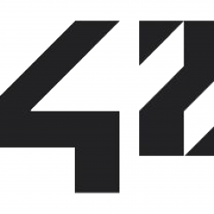

# 42cursus 💻

# INFO 👷

**begin date : 28/sep/2020 🎉**

## Project List

### Common Circle

| CIRCLE | PROJECT                             | LANGUAGE | TOPICS                                    | EXPERIENCE | STATUS            | Date of Completion |
| ------ | ----------------------------------- | -------- | ----------------------------------------- | ---------- | ----------------- | ------------------ |
| 00     | [Libft](./00_Libft)                 | C        | `Library` `Makefile` `Linked list`        | 462 XP     | ✔ success 115/100 | 2020-10-04         |
| 01     | [Netwhat](./01_netwhat)             | Network  | `network` `IP` `network layers` `DHCP`    | 462 XP     | ✔ success 100/100 | 2020-10-12         |
| 01     | [Get_Next_Line](./01_get_next_line) | C        | `file descriptor`                         | 882 XP     | ✔ success 107/100 | 2020-10-09         |
| 01     | [ft_printf](./01_ft_printf)         | C        | `variadic arguments` `Library` `Makefile` | 882 XP     |                   |                    |

